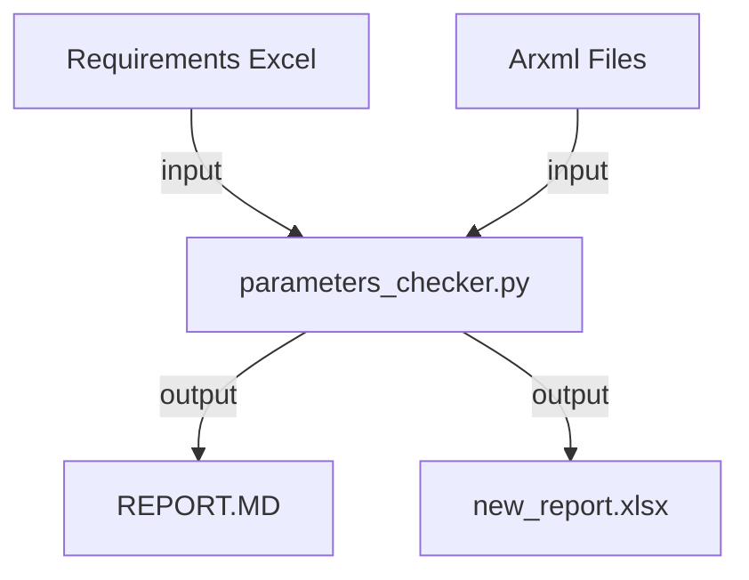

# Check your AUTOSAR project parameters configuration
This module will help you determine if your 
AUTOSAR project is properly configured by comparing the parameters in the configuration
with the parameters specified in the requirements coming from a requirement 
management system.

Adapt it for your project if necessary and use it in CI as a verification method 
for AUTOSAR code configuration for 3rd party code.

It will print the analysis logs in the console. 
No logger is required/implemented for the moment.

The result of the analysis is stored by default in the out directory.
To use this module, please make sure your input is similar to the one provided as a sample 
in the input directory.

Update your requirements management system by importing new_report.xlsx back into the system.

### Sample cmd

Use the requirements.txt file to install a virtual environment and then activate it.

    # Create a python virtual environment
    python -m venv ./venv

    # Activate the venv (depends on os)
    Windows: 
        venv/Source/activate
    Macos: 
        source venv/bin/activate

    # Install the requirements
    python -m pip install -r requirements.txt

    # Execute the sample test
    python parameters_checker.py --config-location input --input input/input_req.xlsx

### Mermaid diagram

